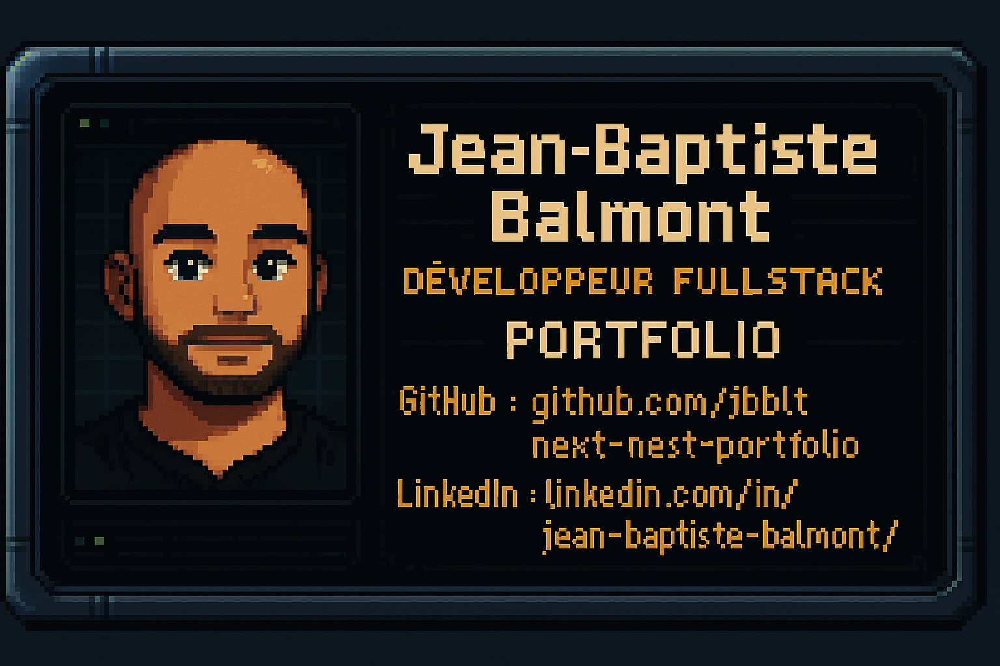

  🔗 LinkedIn: [Jean-Baptiste Balmont](https://www.linkedin.com/in/jean-baptiste-balmont/)  
  🧑‍💻 GitHub: [next-nest-portfolio](https://github.com/jbblt/next-nest-portfolio)

---

## Project Structure

```
next-nest-portfolio/
├── frontend/     ← Next.js (App Router)
├── backend/      ← NestJS API (GraphQL + Prisma + Supabase)
```

### Submodules:
- 🔹 [Frontend (Next.js)](https://github.com/jbblt/next-nest-portfolio-frontend)
- 🔹 [Backend (NestJS)](https://github.com/jbblt/next-nest-portfolio-backend)

---

## 🚀 Tech Stack

| Layer       | Stack                                         |
|-------------|-----------------------------------------------|
| Frontend    | Next.js (App Router), TypeScript      |
| Backend     | NestJS, GraphQL, Prisma                       |
| Database    | Supabase PostgreSQL                           |
| Styling     | Styled-Components, custom UI kit              |
| Deployment  | Vercel (frontend), Render (backend)           |
| Tooling     | ESLint v9, Prettier, GitHub Submodules        |

---

## 🔹 Feature Progression / Roadmap

### 🔄 Core Setup
- [x] Monorepo avec submodules Git (frontend + backend)
- [x] Déploiement séparé Vercel (frontend) et Render (backend)

### 🔹 Backend (NestJS API)
- [x] Prisma connecté à Supabase
- [x] CRUD GraphQL pour Task (create/read/update/delete)
- [X] Validation des inputs + enums status
- [X] Authentification simple with credentials
- [ ] Abonnements GraphQL (WebSocket)

### 🔹 Frontend (Next.js)
- [x] Affichage des Tasks via SSR
- [X] Mutation createTask
- [ ] Mutation updateTask
- [X] Mutation deleteTask
- [x] UI Dashboard design
- [X] Login Form (email + password & SSO)


### 🧠 IA & Analyse de Données
- [ ] Analyse des tâches avec app Python
- [ ] Intégration d’une API IA (OpenAI / perso)
- [ ] Génération automatique de résumé ou de plan d'action

### ✨ Démonstration des Rendus Next.js
- [ ] Route `/ssg` : Static Site Generation
- [ ] Route `/ssr` : Server Side Rendering
- [ ] Route `/isr` : Incremental Static Regeneration

---

## 🔎 Getting Started

```bash
# Clone le projet avec submodules
git clone --recurse-submodules git@github-perso:jbblt/next-nest-portfolio.git

# Lance le backend (NestJS)
cd backend && npm install && npm run start:dev

# Lance le frontend (Next.js)
cd ../frontend && npm install && npm run dev
```
